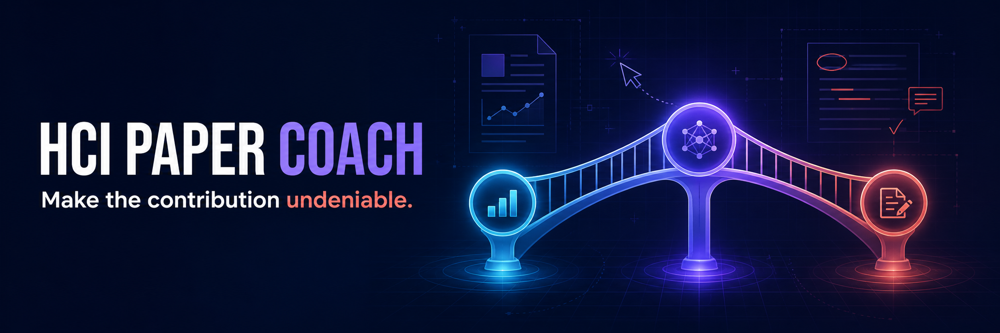

<p align="center">
  
</p>

<p align="center">
  <a href="README.md">English</a> · <a href="README.zh-CN.md">简体中文</a>
</p>

<p align="center">
  <a href="https://github.com/RobbieRao/hci-paper-writing/actions/workflows/ci.yml"></a>
  <a href="LICENSE"></a>
  <a href="skills/hci-paper-writing/SKILL.md"></a>
  
  
  
</p>

<p align="center">
  <strong>Find the weak link before submission.</strong><br>
  An open-source agent skill that maps an HCI paper's contribution to its
  evidence, stress-tests it through HCI-specific reviewer lenses, and keeps the
  revision trail auditable from first draft to rebuttal.
</p>

---

Most academic writing tools start with the prose. HCI Paper Coach starts with the
argument: what the paper claims, what evidence supports it, and where a reviewer
may lose confidence.

The skill is intended for authors submitting to **CHI, CSCW, DIS, UIST, TOCHI,
and related HCI venues**. It uses different review lenses for qualitative
inquiry, interaction techniques, field deployments, research through design,
and other HCI traditions.

> [!IMPORTANT]
> This is an author-side reasoning and revision tool. It does not predict
> acceptance, generate citations, or replace research judgment.

> [!NOTE]
> We are working on a five-year CHI embedding analysis and a rights-cleared dataset
> of accepted/rejected submission journeys, reviews, and rebuttals.
> [Benchmark contributors get priority invitations to the private beta.](#hci-paper-coach-benchmark--in-active-development)

## Three core workflows

| Workflow | What it does | What you get |
|---|---|---|
| **`hci-diagnose`** | Reconstructs the paper's thesis, contribution type, and evidence chain | Contribution diagnosis, claim-evidence matrix, top risks |
| **`hci-red-team`** | Reviews through contribution, method, and reader/venue lenses | Consolidated major risks, champion sentence, killer concern |
| **`hci-revision`** | Turns reviews or diagnosis into ordered work | Revision ledger with evidence needs and verification tests |

The same skill also handles paper planning, section revision, study reporting,
interaction figures, LLM-system reporting, privacy checks, and current venue
policies.

### New in the current open-source release

| Capability | Why it matters |
|---|---|
| **Persistent `.hci-paper/` workspace** | Claims, figures, reviewer comments, policy checks, and revision promises survive across sessions |
| **HCI reviewer panel** | Contribution, method-tradition, and reader/venue lenses are collected before meta-review, with disagreement preserved |
| **Closed-loop rebuttal ledger** | Every response promise points to a manuscript change and a verification step |
| **Machine-readable consistency audit** | Reverse outline, RQs, strong claims, unfinished text, and LaTeX figure/table integrity are available as Markdown or JSON |

This is not a grammar wrapper with an HCI prompt pasted on top. The workflow is
built around HCI's different contribution types and research traditions.

## 30-second install

### Codex and Agent Skills-compatible tools

```bash
git clone https://github.com/RobbieRao/hci-paper-writing.git
cd hci-paper-writing
./install.sh codex
```

### Claude Code

```bash
git clone https://github.com/RobbieRao/hci-paper-writing.git
cd hci-paper-writing
./install.sh claude
```

The installer creates a symlink so `git pull` updates the installed skill. It
refuses to overwrite an existing installation.

Then ask your agent:

```text
Use $hci-paper-writing in hci-diagnose mode on my abstract and contributions.
```

Or:

```text
Use $hci-paper-writing to red-team this draft for CHI 2027.
Separate contribution, method, and reader/venue risks.
```

For a multi-session paper project:

```text
Use $hci-paper-writing in hci-init mode for this project, then run hci-panel.
```

## Local manuscript preflight

Run the deterministic local scanner before semantic review:

```bash
python3 skills/hci-paper-writing/scripts/manuscript_audit.py paper.tex
```

It detects:

- paper structure and missing common headings;
- explicit RQ and contribution markers;
- strong constructs such as trust, understanding, agency, and usefulness;
- common study, ethics, and limitations markers;
- a reverse outline from each section's opening move;
- LaTeX figure/table definitions, references, captions, and orphaned labels;
- unfinished text such as `TODO`, `TBD`, and `FIXME`.

The scanner uses only the Python standard library. It is read-only and makes
**zero network requests**. Its output is a set of review leads, not a paper
quality score.

Add `--format json` when you want stable, machine-readable output for an agent
pipeline or benchmark harness.

<details>
<summary><strong>See an example preflight</strong></summary>

```text
# Local Manuscript Preflight

- File: synthetic-paper.md
- Sections detected: 6
- Privacy: local read-only scan; no network requests

## Contribution Candidates
- We introduce TraceLens and use it as a research artifact...

## Review Leads
- Strong-claim term detected: usefulness
- Verify that each construct is operationalized or carefully bounded
```

Try it on the intentionally synthetic [example paper](examples/synthetic-paper.md).
</details>

## Give each paper a memory

Initialize a local workspace inside an existing paper directory:

```bash
python3 skills/hci-paper-writing/scripts/project_workspace.py \
  /path/to/paper --manuscript paper.tex
```

This creates `.hci-paper/` with a context file and separate ledgers for claims,
figures, reviewer comments, revisions, and verified venue policies. It also
creates `runs/` for comparable audit reports. The initializer has no external
dependencies, makes no network requests, and refuses to overwrite an existing
workspace.

Use `--dry-run` to inspect the plan first, or `--json` to integrate it into
another tool.

## From reviewer concern to verified change

`hci-panel` gathers role-separated readings before synthesis. If the platform
cannot run truly independent reviewers, the skill says so instead of pretending
that sequential personas are independent evidence.

`hci-rebuttal` then assigns stable IDs to concerns and tracks this chain:

```text
reviewer concern -> evidence -> response claim -> manuscript change -> verification
```

The point is not to produce a more confident rebuttal. It is to prevent a good
response letter from drifting away from the paper the committee will actually
read.

## How it works

### Contribution first, prose second

"We conducted a user study" describes an activity. The skill asks what the study
reveals, validates, enables, or changes for HCI before treating it as a
contribution.

### Match the method lens to the paper

Qualitative, quantitative, design-research, systems, field/CSCW, and mixed-method
papers call for different standards. The skill selects the lens that fits the
paper instead of defaulting to an experiment.

### Trace criticism back to evidence

Each major criticism must identify its basis in the manuscript, explain the
consequence, and suggest a credible repair. Strong author claims need evidence,
a citation, or narrower wording.

### Keep corpus comparisons traceable

When comparing a manuscript with a declared corpus, the `hci-grounded` protocol
records the corpus, years, query, filters, coverage gaps, and inspected sources.
Embeddings can retrieve nearby work, but similarity alone does not establish
novelty, quality, or likely acceptance.

### Check current venue policy

Venue rules change. The skill requires agents to verify deadlines, length,
anonymization, accessibility, ethics, AI-use disclosure, and supplementary
material rules from current official sources at run time.

### State the privacy boundary

The local scanner never sends a manuscript anywhere. Data handling for semantic
review depends on the AI platform running the skill, not this repository. Do not
upload a confidential paper you are reviewing without explicit authorization
and policy support.

## What's inside

```text
skills/hci-paper-writing/
├── SKILL.md                         # Router, guardrails, output contracts
├── agents/openai.yaml               # Discoverable UI metadata
├── assets/                          # Intake and revision templates
├── scripts/
│   ├── manuscript_audit.py          # Local deterministic preflight
│   ├── project_workspace.py         # Safe persistent paper-state initializer
│   └── validate_skill.py            # Zero-dependency package validator
└── references/
    ├── contribution-types.md
    ├── evidence-grounding.md
    ├── workflows.md
    ├── method-lenses.md
    ├── study-evidence.md
    ├── section-patterns.md
    ├── reviewer-checklist.md
    ├── reviewer-panel.md
    ├── rebuttal-and-revision.md
    ├── project-workspace.md
    ├── llm-systems.md
    └── policy-and-privacy.md
```

## Design principles

1. The author retains judgment. The agent structures the critique but does not
   decide what the research should claim.
2. The skill does not invent citations, participants, policies, statistics, or
   reviewer consensus.
3. Research strength and venue fit are reported separately. The skill does not
   assign an acceptance probability.
4. Rigor is evaluated within the paper's research tradition.
5. Feedback includes its evidence, severity, proposed repair, and a way to check
   the revision.

## Roadmap

- [x] Contribution diagnosis and claim-evidence workflow
- [x] Three-lens HCI red-team
- [x] Local Markdown/LaTeX/text preflight
- [x] Qualitative, quantitative, design, systems, field, and mixed-method lenses
- [x] Privacy and live-policy guardrails
- [x] Persistent per-paper workspace and machine-readable ledgers
- [x] Reverse outline and LaTeX figure/table consistency checks
- [x] Role-separated HCI reviewer panel and meta-review protocol
- [x] Reviewer-comment, rebuttal, revision, and verification loop
- [ ] HCI Paper Coach Benchmark: five-year CHI embedding analysis
- [ ] Rights-cleared accepted/rejected submissions, reviews, and rebuttals
- [ ] Public benchmark release with versioned splits, annotations, and data cards
- [ ] Numeric and terminology consistency across text, figures, and tables
- [ ] Subcommunity packs for CSCW, DIS, UIST, accessibility, and health HCI
- [ ] Bilingual Chinese/English report templates
- [ ] Longitudinal reviewer-feedback comparison across manuscript versions

<a id="hci-paper-coach-benchmark--in-active-development"></a>

## HCI Paper Coach Benchmark: in progress

We are preparing an open, reproducible benchmark for method-aware HCI paper
feedback. The first release will report three data sources separately:

1. A five-year CHI corpus for embedding-assisted analysis by contribution,
   method, topic, and subcommunity. The release will document exact coverage,
   retrieval settings, source links, and known gaps. We will index or redistribute
   full text only when the license permits it.
2. Accepted and rejected submission histories contributed by authors. A history
   may include the manuscript, reviews, rebuttal, decision, and revisions. Each
   artifact must be cleared for use, allowed by the applicable venue policy, and
   de-identified where necessary.
3. Synthetic and expert-annotated cases for evaluating contribution diagnosis,
   claim-evidence alignment, method fit, reviewer-risk recovery, actionability,
   and false positives.

The benchmark has **not been released**. The current skill has not been trained
or validated on private CHI reviews.

Contributions can include synthetic failure cases, annotation protocols,
retrieval or evaluation code, public metadata sources, and authorized submission
histories. Contributors will receive priority invitations to the private beta,
subject to capacity and data/consent checks. See
[CONTRIBUTING.md](CONTRIBUTING.md). Do not attach confidential material to a
public issue.

## Contributing

Useful contributions include method-specific failure cases, synthetic test
manuscripts, and current official policy sources. See
[CONTRIBUTING.md](CONTRIBUTING.md).

If the project helps you catch a serious problem before review, consider starring
the repository so other HCI researchers can find it.

## Responsible use

- Use the project for formative author feedback, not automated peer-review
  gatekeeping.
- Verify citations and venue policies yourself.
- Follow your venue's AI-use disclosure policy.
- Do not submit confidential manuscripts belonging to others to third-party
  models.
- The project is not affiliated with or endorsed by ACM, SIGCHI, CHI, CSCW, DIS,
  UIST, or any other venue.

## License and provenance

MIT licensed. See [LICENSE](LICENSE) and [THIRD_PARTY_NOTICES.md](THIRD_PARTY_NOTICES.md).
Release history is recorded in [CHANGELOG.md](CHANGELOG.md).

The project is independently authored and informed by public HCI submission
guidance and open academic-writing workflows. No third-party source code is
vendored.
